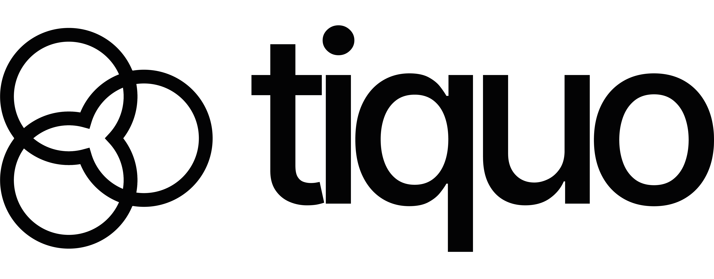

# Arc Tab Switcher for Chrome

A true Arc/Zen browser-style MRU (Most Recently Used) tab switcher and copy current tab for Chrome. Switch between your 5 most recent tabs instantly with a minimal, fast UI!

**Sponsored by [Tiquo](https://www.tiquo.co/)**

## Features

🎯 **True MRU Switching** - Just like Arc/Zen browser! Switch between your 5 most recently used tabs  
⚡ **Ultra-Fast UI** - Instant appearance, no animations or delays  
🔄 **Cmd+Q Only** - Simple keyboard-only navigation, keep pressing to cycle  
🎨 **Ultra Minimal** - Clean cards with favicon icons, no text or clutter  
⌨️ **Keyboard Only** - Works exclusively with Cmd+Q/Ctrl+Q, no mouse interaction  
🚀 **No Distractions** - Transparent overlay, no dimming, just your tabs  
⚡ **Instant Response** - Zero animation delays for maximum speed

## Installation

### Step 1: Load Unpacked Extension (Developer Mode)

1. Download or clone this extension folder
2. Open Chrome and navigate to `chrome://extensions/`
3. Enable **Developer mode** (toggle in the top right)
4. Click **Load unpacked**
5. Select the `arc-tab-switcher` folder
6. Done! The extension is now installed

### Step 2: Change Keyboard Shortcut

If Ctrl+Q doesn't work or you want a different shortcut:

1. Go to `chrome://extensions/shortcuts`
2. Find "Arc Tab Switcher"
3. Click the pencil icon next to "Copy current page URL"
4. Press your desired key combination (shift + command + C is recommended)
5. Click the pencil icon next to "Toggle tab switcher"
6. Press your desired key combination (control + Q or control + A is recommended)

All done!

## Usage

### How It Works (Just Like Arc/Zen!)

The tab switcher tracks your 5 most recently used tabs and lets you cycle through them:

**Press:** your selected key combination
- Visual UI appears instantly showing your 5 most recent tabs
- Previous tab is pre-selected (index 1)
- Keep pressing the key combination to cycle forward through the list
- **Release Cmd/Ctrl** to instantly switch to selected tab
- Switcher stays open as long as you hold Cmd/Ctrl

### Navigation

**Keyboard Controls:**
- **Ctrl+Q** - Cycle to next tab (keep pressing to cycle through)
- **Esc** - Cancel and close (return to current tab)

That's it! Just two keys.

### Tips

- ⚡ UI appears **instantly** when you press your key combination like Ctrl+Q - zero delay
- 🎨 Selected tab is highlighted with blue border
- ✅ Current tab has a green border
- 🔄 **Instant key release detection** - exits immediately when you release Cmd/Ctrl key
- 🚀 **ZERO animations** - all transitions disabled for maximum speed
- 📸 **Real page previews** - shows actual screenshots of your recent tabs
- 💾 Smart caching - captures tabs automatically as you browse
- ⌨️ No mouse/cursor interaction - keyboard only by design
- 🌟 Clean dropshadow - no page overlay or blur, content stays fully visible

## How Screenshot Caching Works

The extension automatically captures and caches screenshots of your tabs to show real page previews:

1. **Automatic Capture:**
   - When you switch to a tab, it captures a screenshot after 500ms
   - When a page finishes loading, it captures a screenshot
   - Screenshots are stored in memory (JPEG format, 50% quality)

2. **Cache Management:**
   - Stores up to 20 most recent tab screenshots
   - Automatically removes old screenshots when cache is full
   - Cleans up screenshots when tabs are closed

3. **Fallback Preview:**
   - If a tab hasn't been active yet, shows a mock preview with favicon
   - Mock preview looks like a page with simulated content

4. **Limitations:**
   - Can't capture screenshots of `chrome://` or extension pages
   - Only captures active tabs (Chrome security restriction)
   - Screenshots update automatically as you browse

## Customization

Want to customize the appearance? Edit `styles.css`:

- Change colors (search for color values)
- Adjust card size (modify `.arc-tab-card` width/height)
- Change border styles (modify `.arc-tab-card.selected`)
- Adjust preview height (modify `.arc-tab-preview` height)

## Files

- `manifest.json` - Extension configuration
- `background.js` - Background service worker with MRU tracking
- `content.js` - Main tab switcher logic with instant toggle & cycling
- `styles.css` - Beautiful Arc-inspired styling
- `icon*.png` - Extension icons

## Troubleshooting

### Keyboard shortcut not working?

1. Check if another extension is using the same shortcut
2. Go to `chrome://extensions/shortcuts` and set a different key combination
3. On Mac, Cmd+Q might be intercepted by the system (try Cmd+Shift+Q)

### Extension not showing up?

1. Make sure Developer Mode is enabled
2. Check the Console in `chrome://extensions/` for errors
3. Try reloading the extension (click the refresh icon)

### Tabs not showing?

1. Refresh the current page after installing
2. Check if the extension has necessary permissions
3. Look for console errors in DevTools (F12)

## Known Limitations

- Chrome can only capture screenshots of **active tabs** for security reasons
- Screenshots are cached automatically as you browse (up to 20 recent tabs)
- Tabs that haven't been active recently show a mock preview with favicon
- Some Chrome internal pages (chrome://) don't allow content scripts or screenshots
- The switcher may not work on the Chrome Web Store or other restricted pages
- Detects Control/Command key release for instant switching
- Only tracks the 5 most recent tabs (just like Arc browser)

## How It Compares to Arc/Zen

This extension replicates Arc and Zen browser's exact MRU tab switching behavior:

✅ **Same as Arc/Zen:**
- Tracks 5 most recent tabs in MRU order
- Visual UI appears on first press showing recent tabs
- Multiple presses cycle through tabs
- Window-specific MRU lists
- Auto-switch on Ctrl/Cmd key release (detected via keyup event)
- Real page screenshots cached automatically
- Minimal, fast UI with no animations or distractions

🔄 **Differences:**
- Detects Ctrl/Cmd key release just like native OS switchers
- Works in Chrome, Edge, Brave, and other Chromium browsers
- Customizable keyboard shortcuts
- Clean horizontal card layout with page preview tabs

## License

Free to use and modify for personal use. Enjoy! 🚀

---

## Sponsored by Tiquo

<a href="https://www.tiquo.co/" target="_blank">
  <picture>
    <source media="(prefers-color-scheme: dark)" srcset="tiquo-logo-white.png">
    <source media="(prefers-color-scheme: light)" srcset="tiquo-logo-black.png">
    
  </picture>
</a>

Running a hotel, restaurant, spa, or venue shouldn't require 20+ different tools. With [Tiquo](https://www.tiquo.co/), every product, service, booking, form, contract, membership and transaction, flows through a single system – built for adaptability, scale, and AI. Simpler for staff, seamless for customers, smarter for the business.

